# LifeArc POC - Architecture Diagrams

## 1. Overall Solution Architecture

```mermaid
flowchart LR
    subgraph Sources["🔗 External Sources"]
        direction TB
        GH[("GitHub\nDBT Code")]
        LAB[("Lab Systems\nClinical Data")]
        DOCS[("Documents\nResearch PDFs")]
    end

    subgraph Snowflake["❄️ SNOWFLAKE - Single Platform"]
        subgraph Ingestion["📥 Ingestion"]
            direction TB
            GIT["Git Repository"]
            STAGE["Internal Stages"]
        end

        subgraph Storage["💾 Medallion Storage"]
            direction TB
            BRONZE["🥉 Bronze"]
            SILVER["🥈 Silver"]
            GOLD["🥇 Gold"]
        end

        subgraph Intelligence["🧠 AI/ML (Data Stays Here)"]
            direction TB
            CORTEX["Cortex LLM\n+ Search"]
            MLPIPE["Snowflake ML"]
        end

        subgraph Governance["🔒 Governance"]
            direction TB
            TAGS["Tags + Policies"]
        end
    end

    subgraph Consumption["👥 Consumption"]
        direction TB
        APPS["📊 Streamlit Apps\n3 Deployed"]
        SHARE["🤝 Zero-Copy Share\nLIFEARC_CRO_SHARE"]
    end

    subgraph Users["🎯 Business Value"]
        direction TB
        EXEC["Executives\nData-Driven Decisions"]
        CRO["CRO Partners\nLive Collaboration"]
    end

    GH --> GIT
    LAB --> STAGE
    DOCS --> STAGE
    
    GIT --> BRONZE
    STAGE --> BRONZE
    BRONZE --> SILVER --> GOLD
    
    GOLD --> CORTEX
    GOLD --> MLPIPE
    GOLD --> TAGS
    
    CORTEX --> APPS
    MLPIPE --> APPS
    TAGS --> SHARE
    
    APPS --> EXEC
    SHARE -.->|"Zero-Copy\nReal-Time\nGoverned"| CRO

    style Snowflake fill:#29B5E8,color:#fff
    style Intelligence fill:#FF6B35,color:#fff
    style Governance fill:#2E8B57,color:#fff
```

**Key Message:** Everything runs in ONE platform. Data never leaves. AI is HIPAA-safe.

---

## 2. Medallion Architecture (DBT Pipeline)

```mermaid
flowchart LR
    subgraph Sources["Source Systems"]
        S1[("Clinical Data")]
        S2[("Compound Library")]
        S3[("Gene Sequences")]
    end

    subgraph Bronze["Bronze Layer (Staging)"]
        direction TB
        STG1["stg_clinical_results"]
        STG2["stg_compounds"]
        STG3["stg_gene_sequences"]
        SEED1["clinical_trial_phases"]
        SEED2["drug_likeness_thresholds"]
        SEED3["gene_types"]
    end

    subgraph Silver["Silver Layer (Intermediate)"]
        direction TB
        INT1["int_compound_properties\n• Lipinski calculations\n• Drug-likeness scoring"]
        INT2["int_trial_patient_outcomes\n• Response aggregation\n• Cohort analysis"]
    end

    subgraph Gold["Gold Layer (Marts)"]
        direction TB
        MART1["mart_compound_analysis\n• Pipeline health\n• Success predictions"]
        MART2["mart_trial_efficacy\n• Response rates\n• PFS/OS metrics"]
        MART3["mart_gene_analysis\n• GC content\n• Sequence metrics"]
    end

    subgraph Consumers["Data Consumers"]
        BI["BI Dashboards"]
        ML["ML Models"]
        ANALYST["Cortex Analyst"]
    end

    S1 --> STG1
    S2 --> STG2
    S3 --> STG3

    STG1 --> INT2
    STG2 --> INT1
    STG3 --> MART3

    SEED1 --> INT2
    SEED2 --> INT1
    SEED3 --> MART3

    INT1 --> MART1
    INT2 --> MART2

    MART1 --> BI
    MART2 --> ML
    MART3 --> ANALYST

    style Bronze fill:#CD7F32,color:#fff
    style Silver fill:#C0C0C0,color:#000
    style Gold fill:#FFD700,color:#000
```

---

## 3. Snowflake Intelligence Architecture

**Key Message:** Natural language → SQL → Data-backed answer. PHI never leaves Snowflake.

---

## 4. ML Pipeline Architecture

---

## 5. Secure Data Sharing Architecture (Snowflake-Unique)

---

## 6. Data Governance Architecture

```mermaid
flowchart LR
    subgraph Classification["🏷️ Classification"]
        direction TB
        T1["DATA_CLASSIFICATION\nPHI • PII • CONFIDENTIAL"]
        T2["DATA_DOMAIN\nCLINICAL • GENOMICS • COMPOUND"]
        T3["RETENTION_PERIOD\n1_YEAR • 10_YEARS • INDEFINITE"]
        T4["PII_TYPE\nPATIENT_ID • AGE • DOB"]
        T5["DATA_SENSITIVITY\nPUBLIC → HIGHLY_CONFIDENTIAL"]
    end

    subgraph Protection["🛡️ Protection"]
        direction TB
        M1["MASK_PATIENT_ID\n→ SHA2 hash"]
        M2["MASK_AGE\n→ Age bands"]
        RAP["SITE_BASED_ACCESS\n→ Row filtering"]
    end

    subgraph Tables["💾 Protected Tables"]
        CTR[("CLINICAL_TRIAL_RESULTS\n• patient_id: MASKED\n• patient_age: MASKED\n• site_id: ROW FILTERED")]
    end

    subgraph Roles["👥 Role Hierarchy"]
        direction TB
        ADMIN["ACCOUNTADMIN\nFull Access"]
        ANALYST["DATA_ANALYST\nMasked View"]
        PARTNER["PARTNER_ROLE\nFiltered + Masked"]
    end

    subgraph Audit["📋 Audit"]
        direction TB
        LOG[("Access Log")]
        COMPLIANCE["HIPAA • GxP\n21 CFR Part 11"]
    end

    T1 --> M1
    T1 --> M2
    T4 --> M1
    T4 --> M2
    T2 --> RAP
    
    M1 --> CTR
    M2 --> CTR
    RAP --> CTR
    
    ADMIN -->|Full| CTR
    ANALYST -->|Masked| CTR
    PARTNER -->|Filtered| CTR
    
    CTR --> LOG
    LOG --> COMPLIANCE

    style Classification fill:#2E8B57,color:#fff
    style Protection fill:#4169E1,color:#fff
    style Tables fill:#FFC107,color:#000
    style Roles fill:#6F42C1,color:#fff
    style Audit fill:#8B4513,color:#fff
```

---

## 7. Unstructured Data Processing Architecture

**Key Message:** Unstructured → Structured → SQL-queryable. All in Snowflake, no external tools.

---

## 8. Snowflake vs Competitors - Why It Matters for LifeArc

```mermaid
flowchart LR
    subgraph Challenge["🎯 LifeArc Challenge"]
        direction TB
        C1["Share trial data\nwith CROs securely"]
        C2["AI on PHI data\n(HIPAA compliance)"]
        C3["Audit trail for\nregulatory (GxP)"]
        C4["Cost control\n(variable workloads)"]
    end

    subgraph Snowflake["❄️ Snowflake Solution"]
        direction TB
        S1["✅ Zero-Copy Share\nNo data duplication"]
        S2["✅ Cortex AI\nData stays in platform"]
        S3["✅ Time Travel\n90 days default"]
        S4["✅ Per-Second Billing\nAuto-suspend"]
    end

    subgraph Databricks["🔶 Databricks Gap"]
        direction TB
        D1["❌ Delta Sharing\nrequires data copy"]
        D2["❌ External APIs\ndata leaves platform"]
        D3["⚠️ 30 days\nrequires config"]
        D4["❌ Per-hour billing\ncluster overhead"]
    end

    subgraph Fabric["🔷 Fabric Gap"]
        direction TB
        F1["❌ No cross-org\nsharing"]
        F2["❌ Azure OpenAI\ndata leaves warehouse"]
        F3["❌ No native\nTime Travel"]
        F4["❌ Capacity-based\nno auto-suspend"]
    end

    C1 --> S1
    C2 --> S2
    C3 --> S3
    C4 --> S4
    
    S1 -.-x D1
    S2 -.-x D2
    S3 -.-x D3
    S4 -.-x D4
    
    S1 -.-x F1
    S2 -.-x F2
    S3 -.-x F3
    S4 -.-x F4

    style Challenge fill:#6C757D,color:#fff
    style Snowflake fill:#29B5E8,color:#fff
    style Databricks fill:#FF3621,color:#fff
    style Fabric fill:#0078D4,color:#fff
```

**Key Message:** Snowflake solves LifeArc's specific challenges. Competitors have architectural gaps.

---

## 9. Demo Flow Sequence

---

## 10. The 9 Snowflake Differentiators - Executive Summary

```mermaid
flowchart LR
    subgraph Differentiators["❄️ 9 SNOWFLAKE DIFFERENTIATORS"]
        direction TB
        subgraph DataMgmt["Data Management"]
            D1["1️⃣ Zero-Copy Sharing\nLIFEARC_CRO_SHARE"]
            D2["2️⃣ Instant Cloning\nDev/Test in seconds"]
            D3["3️⃣ Time Travel\n90 days audit trail"]
        end
        subgraph AI["AI/ML"]
            D4["4️⃣ Cortex AI\nHIPAA-safe LLMs"]
            D5["5️⃣ Cortex Search\nSemantic retrieval"]
            D6["6️⃣ Native ML\nData never leaves"]
        end
        subgraph Platform["Platform"]
            D7["7️⃣ SQL Governance\nTags queryable"]
            D8["8️⃣ Streamlit Apps\n3 deployed"]
            D9["9️⃣ Per-Second Billing\n4 resource monitors"]
        end
    end

    subgraph Validated["✅ POC VALIDATED"]
        direction TB
        V1["93% tests passed\n42/45 checks"]
        V2["5 'Why' questions\nanswered"]
        V3["3 Streamlit apps\ndeployed"]
    end

    subgraph Value["💰 BUSINESS VALUE"]
        direction TB
        B1["CRO Collaboration\nReal-time, governed"]
        B2["Regulatory Ready\nGxP, HIPAA, 21 CFR 11"]
        B3["Cost Optimized\nAuto-suspend, no copies"]
    end

    Differentiators --> Validated
    Validated --> Value

    style Differentiators fill:#29B5E8,color:#fff
    style Validated fill:#28A745,color:#fff
    style Value fill:#FFD700,color:#000
```

**Key Message:** 9 capabilities competitors cannot match → Validated in POC → Real business value for LifeArc.

---

## Usage

These diagrams are rendered using [Mermaid](https://mermaid.js.org/). To view:

1. **GitHub**: Diagrams render automatically in GitHub markdown
2. **Snowsight**: Copy to a markdown cell in a notebook
3. **VS Code**: Install "Markdown Preview Mermaid Support" extension
4. **Online**: Paste at [mermaid.live](https://mermaid.live)

---

## Key Architecture Decisions

| Decision | Rationale |
|----------|-----------|
| **Semantic View over YAML** | Native Snowflake, SQL-manageable, no external files |
| **Cortex over external LLMs** | PHI stays in Snowflake, HIPAA compliance |
| **Zero-copy sharing** | No data duplication, real-time, auditable |
| **Native DBT Project** | Git-synced, version-controlled, no external orchestrator |
| **Snowflake ML** | Data never leaves, integrated with governance |
| **Object tags** | SQL-queryable compliance, automatic policy enforcement |
