# LifeArc POC - Architecture Diagrams

## 1. Overall Solution Architecture

```mermaid
flowchart LR
    subgraph Sources["🔗 Sources"]
        direction TB
        GH[("GitHub")]
        EXT[("External\nData")]
    end

    subgraph Ingestion["📥 Ingestion"]
        direction TB
        GIT["Git Repository\nLIFEARC_GIT_REPO"]
        DBT["Native DBT\nVERSION$8"]
    end

    subgraph Storage["💾 Storage (Medallion)"]
        direction TB
        BRONZE["🥉 Bronze\nPUBLIC_BRONZE"]
        SILVER["🥈 Silver\nPUBLIC_SILVER"]
        GOLD["🥇 Gold\nPUBLIC_GOLD"]
    end

    subgraph Processing["⚙️ Processing"]
        direction TB
        subgraph AI["Cortex AI"]
            SV["Semantic View"]
            LLM["Cortex LLM"]
            SEARCH["Cortex Search"]
        end
        subgraph ML["ML Pipeline"]
            FEATURES["Feature Store"]
            MODEL["ML Model"]
            REGISTRY["Registry"]
        end
        subgraph Gov["Governance"]
            TAGS["Tags"]
            MASK["Masking"]
            RAP["Row Access"]
        end
    end

    subgraph Consumption["👥 Consumption"]
        direction TB
        APP1["📊 Intelligence\nDemo"]
        APP2["📁 Unstructured\nDemo"]
        APP3["🧪 ML\nDashboard"]
        SHARE["🤝 CRO Share\nZero-Copy"]
    end

    subgraph Users["🎯 Users"]
        direction TB
        EXEC["Executives"]
        DS["Data Scientists"]
        CRO["CRO Partners"]
    end

    GH --> GIT
    EXT --> GIT
    GIT --> DBT
    DBT --> BRONZE
    BRONZE --> SILVER
    SILVER --> GOLD
    
    GOLD --> SV
    GOLD --> FEATURES
    GOLD --> TAGS
    
    SV --> LLM
    SV --> SEARCH
    FEATURES --> MODEL
    MODEL --> REGISTRY
    TAGS --> MASK
    MASK --> RAP
    
    LLM --> APP1
    SEARCH --> APP1
    REGISTRY --> APP3
    RAP --> SHARE
    
    APP1 --> EXEC
    APP3 --> DS
    SHARE -.->|Live Data| CRO

    style Sources fill:#6C757D,color:#fff
    style Ingestion fill:#17A2B8,color:#fff
    style Storage fill:#FFC107,color:#000
    style Processing fill:#29B5E8,color:#fff
    style Consumption fill:#28A745,color:#fff
    style Users fill:#6F42C1,color:#fff
```

---

## 2. Medallion Architecture (DBT Pipeline)

```mermaid
flowchart LR
    subgraph Sources["Source Systems"]
        S1[("Clinical Data")]
        S2[("Compound Library")]
        S3[("Gene Sequences")]
    end

    subgraph Bronze["Bronze Layer (Staging)"]
        direction TB
        STG1["stg_clinical_results"]
        STG2["stg_compounds"]
        STG3["stg_gene_sequences"]
        SEED1["clinical_trial_phases"]
        SEED2["drug_likeness_thresholds"]
        SEED3["gene_types"]
    end

    subgraph Silver["Silver Layer (Intermediate)"]
        direction TB
        INT1["int_compound_properties\n• Lipinski calculations\n• Drug-likeness scoring"]
        INT2["int_trial_patient_outcomes\n• Response aggregation\n• Cohort analysis"]
    end

    subgraph Gold["Gold Layer (Marts)"]
        direction TB
        MART1["mart_compound_analysis\n• Pipeline health\n• Success predictions"]
        MART2["mart_trial_efficacy\n• Response rates\n• PFS/OS metrics"]
        MART3["mart_gene_analysis\n• GC content\n• Sequence metrics"]
    end

    subgraph Consumers["Data Consumers"]
        BI["BI Dashboards"]
        ML["ML Models"]
        ANALYST["Cortex Analyst"]
    end

    S1 --> STG1
    S2 --> STG2
    S3 --> STG3

    STG1 --> INT2
    STG2 --> INT1
    STG3 --> MART3

    SEED1 --> INT2
    SEED2 --> INT1
    SEED3 --> MART3

    INT1 --> MART1
    INT2 --> MART2

    MART1 --> BI
    MART2 --> ML
    MART3 --> ANALYST

    style Bronze fill:#CD7F32,color:#fff
    style Silver fill:#C0C0C0,color:#000
    style Gold fill:#FFD700,color:#000
```

---

## 3. Snowflake Intelligence Architecture

---

## 4. ML Pipeline Architecture

---

## 5. Secure Data Sharing Architecture (Snowflake-Unique)

---

## 6. Data Governance Architecture

```mermaid
flowchart LR
    subgraph Classification["🏷️ Classification"]
        direction TB
        T1["DATA_CLASSIFICATION\nPHI • PII • CONFIDENTIAL"]
        T2["DATA_DOMAIN\nCLINICAL • GENOMICS • COMPOUND"]
        T3["RETENTION_PERIOD\n1_YEAR • 10_YEARS • INDEFINITE"]
        T4["PII_TYPE\nPATIENT_ID • AGE • DOB"]
        T5["DATA_SENSITIVITY\nPUBLIC → HIGHLY_CONFIDENTIAL"]
    end

    subgraph Protection["🛡️ Protection"]
        direction TB
        M1["MASK_PATIENT_ID\n→ SHA2 hash"]
        M2["MASK_AGE\n→ Age bands"]
        RAP["SITE_BASED_ACCESS\n→ Row filtering"]
    end

    subgraph Tables["💾 Protected Tables"]
        CTR[("CLINICAL_TRIAL_RESULTS\n• patient_id: MASKED\n• patient_age: MASKED\n• site_id: ROW FILTERED")]
    end

    subgraph Roles["👥 Role Hierarchy"]
        direction TB
        ADMIN["ACCOUNTADMIN\nFull Access"]
        ANALYST["DATA_ANALYST\nMasked View"]
        PARTNER["PARTNER_ROLE\nFiltered + Masked"]
    end

    subgraph Audit["📋 Audit"]
        direction TB
        LOG[("Access Log")]
        COMPLIANCE["HIPAA • GxP\n21 CFR Part 11"]
    end

    T1 --> M1
    T1 --> M2
    T4 --> M1
    T4 --> M2
    T2 --> RAP
    
    M1 --> CTR
    M2 --> CTR
    RAP --> CTR
    
    ADMIN -->|Full| CTR
    ANALYST -->|Masked| CTR
    PARTNER -->|Filtered| CTR
    
    CTR --> LOG
    LOG --> COMPLIANCE

    style Classification fill:#2E8B57,color:#fff
    style Protection fill:#4169E1,color:#fff
    style Tables fill:#FFC107,color:#000
    style Roles fill:#6F42C1,color:#fff
    style Audit fill:#8B4513,color:#fff
```

---

## 7. Unstructured Data Processing Architecture

```mermaid
flowchart LR
    subgraph Sources["Unstructured Sources"]
        FASTA["FASTA Files\n(Gene Sequences)"]
        SDF["SDF Files\n(Molecular Structures)"]
        JSON["JSON Files\n(Clinical Protocols)"]
        PDF["Research Documents"]
    end

    subgraph Processing["Snowflake Processing"]
        subgraph UDFs["Python UDFs"]
            PARSE["PARSE_FASTA\n• Extract sequences\n• Calculate GC content\n• Parse metadata"]
        end
        
        subgraph Variant["VARIANT Storage"]
            VAR["Semi-structured Data\n• Nested JSON\n• Flexible schema\n• Path notation"]
        end
        
        subgraph CortexAI["Cortex AI"]
            LLM["Cortex COMPLETE\n• Summarization\n• Entity extraction\n• Q&A"]
            SEARCH["Cortex Search\n• Semantic similarity\n• Document retrieval"]
        end
    end

    subgraph Storage["Structured Storage"]
        GENES[("GENE_SEQUENCES\n• sequence_id\n• gc_content\n• seq_length")]
        COMPOUNDS[("COMPOUND_LIBRARY\n• properties: VARIANT\n• mol_block: TEXT")]
        TRIALS[("CLINICAL_TRIALS\n• protocol_data: VARIANT")]
        RESEARCH[("RESEARCH_INTELLIGENCE\n• full_text\n• key_finding")]
    end

    subgraph Query["Query Patterns"]
        SQL1["SELECT gc_content\nFROM gene_sequences"]
        SQL2["SELECT properties:logP\nFROM compounds"]
        SQL3["LATERAL FLATTEN\n(protocol_data:arms)"]
        SQL4["Cortex Search\n'DNA repair inhibitors'"]
    end

    FASTA --> PARSE
    PARSE --> GENES
    
    SDF --> VAR
    VAR --> COMPOUNDS
    
    JSON --> VAR
    VAR --> TRIALS
    
    PDF --> LLM
    LLM --> RESEARCH
    RESEARCH --> SEARCH
    
    GENES --> SQL1
    COMPOUNDS --> SQL2
    TRIALS --> SQL3
    SEARCH --> SQL4

    style Processing fill:#29B5E8,color:#fff
    style CortexAI fill:#FF6B35,color:#fff
```

---

## 8. Snowflake vs Competitors Comparison

```mermaid
flowchart LR
    subgraph Requirement["🎯 Life Sciences Requirements"]
        direction TB
        R1["Zero-Copy Sharing"]
        R2["Time Travel"]
        R3["Instant Cloning"]
        R4["HIPAA-Safe AI"]
        R5["Per-Second Billing"]
        R6["Auto-Suspend"]
        R7["Native Apps"]
    end

    subgraph Snowflake["❄️ Snowflake"]
        direction TB
        S1["✅ Native zero-copy"]
        S2["✅ 90 days default"]
        S3["✅ Instant, metadata-only"]
        S4["✅ Cortex (data stays)"]
        S5["✅ Per-second"]
        S6["✅ Auto-suspend/resume"]
        S7["✅ Native Streamlit"]
    end

    subgraph Databricks["🔶 Databricks"]
        direction TB
        D1["⚠️ Delta Sharing copies"]
        D2["⚠️ 30 days, config needed"]
        D3["⚠️ Requires setup"]
        D4["❌ External APIs needed"]
        D5["❌ Per-hour"]
        D6["⚠️ Manual cluster mgmt"]
        D7["⚠️ Databricks Apps newer"]
    end

    subgraph Fabric["🔷 Microsoft Fabric"]
        direction TB
        F1["❌ No zero-copy"]
        F2["❌ No Time Travel"]
        F3["❌ Full copy required"]
        F4["❌ Azure OpenAI (data leaves)"]
        F5["❌ Capacity-based"]
        F6["⚠️ Limited auto-scale"]
        F7["⚠️ Power BI only"]
    end

    R1 --> S1
    R2 --> S2
    R3 --> S3
    R4 --> S4
    R5 --> S5
    R6 --> S6
    R7 --> S7

    style Requirement fill:#6C757D,color:#fff
    style Snowflake fill:#29B5E8,color:#fff
    style Databricks fill:#FF3621,color:#fff
    style Fabric fill:#0078D4,color:#fff
```

---

## 9. Demo Flow Sequence

---

## 10. Complete System Context

---

## Usage

These diagrams are rendered using [Mermaid](https://mermaid.js.org/). To view:

1. **GitHub**: Diagrams render automatically in GitHub markdown
2. **Snowsight**: Copy to a markdown cell in a notebook
3. **VS Code**: Install "Markdown Preview Mermaid Support" extension
4. **Online**: Paste at [mermaid.live](https://mermaid.live)

---

## Key Architecture Decisions

| Decision | Rationale |
|----------|-----------|
| **Semantic View over YAML** | Native Snowflake, SQL-manageable, no external files |
| **Cortex over external LLMs** | PHI stays in Snowflake, HIPAA compliance |
| **Zero-copy sharing** | No data duplication, real-time, auditable |
| **Native DBT Project** | Git-synced, version-controlled, no external orchestrator |
| **Snowflake ML** | Data never leaves, integrated with governance |
| **Object tags** | SQL-queryable compliance, automatic policy enforcement |
